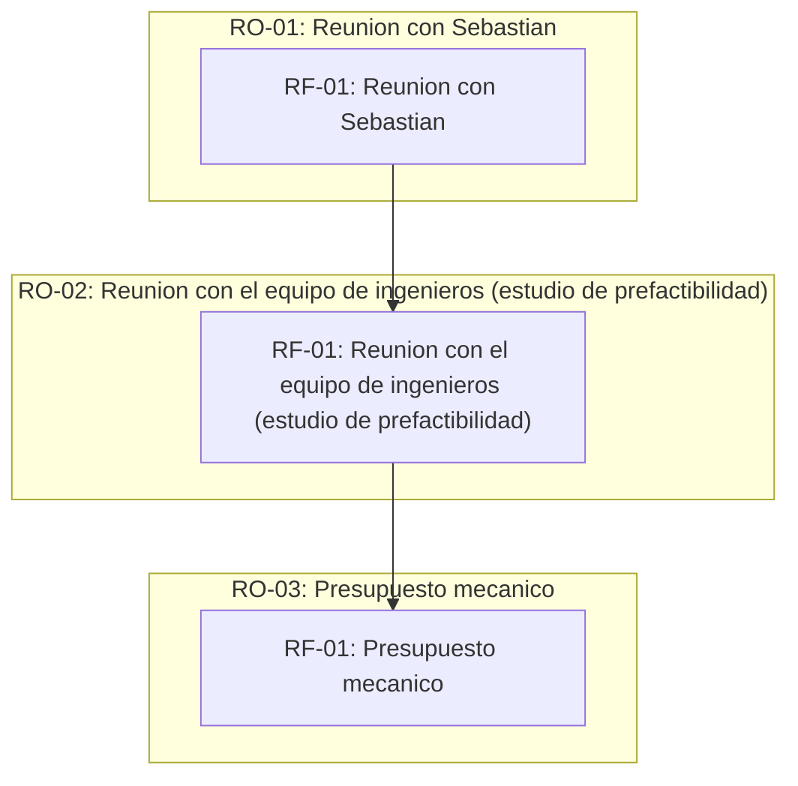

# Grafo de Dependencias -- mauri_vad

_Generado automaticamente el 2026-09-12T15:44:48.271Z -- no editar a mano, se sobreescribe en cada publicacion._

```mermaid
graph TD
  subgraph US_1789213601492["RO-01: Reunion con Sebastian"]
    REQ_1789213601498["RF-01: Reunion con Sebastian"]
  end
  subgraph US_1789213867397["RO-02: Reunion con el equipo de ingenieros (estudio de prefactibilidad)"]
    REQ_1789213867404["RF-01: Reunion con el equipo de ingenieros (estudio de prefactibilidad)"]
  end
  subgraph US_1789214807204["RO-03: Presupuesto mecanico"]
    REQ_1789214807210["RF-01: Presupuesto mecanico"]
  end
  REQ_1789213601498 --> REQ_1789213867404
  REQ_1789213867404 --> REQ_1789214807210
```