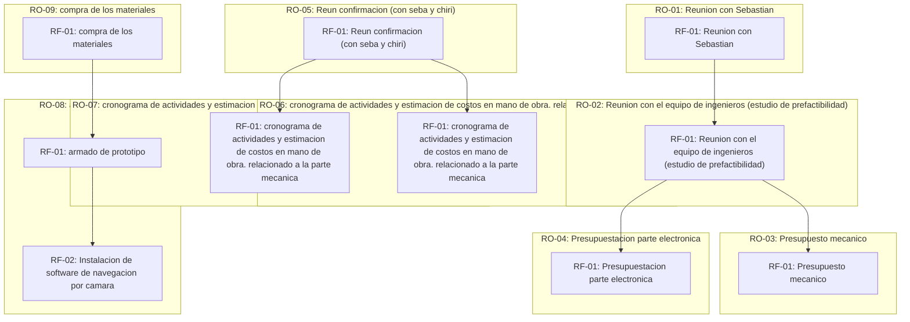

# Grafo de Dependencias -- mauri_vad

_Generado automaticamente el 2026-09-14T17:00:29.474Z -- no editar a mano, se sobreescribe en cada publicacion._

```mermaid
graph TD
  subgraph US_1789213601492["RO-01: Reunion con Sebastian"]
    REQ_1789213601498["RF-01: Reunion con Sebastian"]
  end
  subgraph US_1789213867397["RO-02: Reunion con el equipo de ingenieros (estudio de prefactibilidad)"]
    REQ_1789213867404["RF-01: Reunion con el equipo de ingenieros (estudio de prefactibilidad)"]
  end
  subgraph US_1789214807204["RO-03: Presupuesto mecanico"]
    REQ_1789214807210["RF-01: Presupuesto mecanico"]
  end
  subgraph US_1789228644037["RO-04: Presupuestacion parte electronica"]
    REQ_1789228644049["RF-01: Presupuestacion parte electronica"]
  end
  subgraph US_1789228786617["RO-05: Reun confirmacion (con seba y chiri)"]
    REQ_1789228786624["RF-01: Reun confirmacion (con seba y chiri)"]
  end
  subgraph US_1789229144833["RO-06: cronograma de actividades y estimacion de costos en mano de obra. relacionado a la parte mecanica"]
    REQ_1789229144846["RF-01: cronograma de actividades y estimacion de costos en mano de obra. relacionado a la parte mecanica"]
  end
  subgraph US_1789229156281["RO-07: cronograma de actividades y estimacion de costos en mano de obra. relacionado a la parte mecanica"]
    REQ_1789229156293["RF-01: cronograma de actividades y estimacion de costos en mano de obra. relacionado a la parte mecanica"]
  end
  subgraph US_1789229530073["RO-08: armado de prototipo"]
    REQ_1789229530082["RF-01: armado de prototipo"]
    REQ_1789405125901["RF-02: Instalacion de software de navegacion por camara"]
  end
  subgraph US_1789229726512["RO-09: compra de los materiales"]
    REQ_1789229726537["RF-01: compra de los materiales"]
  end
  REQ_1789213601498 --> REQ_1789213867404
  REQ_1789213867404 --> REQ_1789214807210
  REQ_1789213867404 --> REQ_1789228644049
  REQ_1789228786624 --> REQ_1789229144846
  REQ_1789228786624 --> REQ_1789229156293
  REQ_1789229726537 --> REQ_1789229530082
  REQ_1789229530082 --> REQ_1789405125901
```